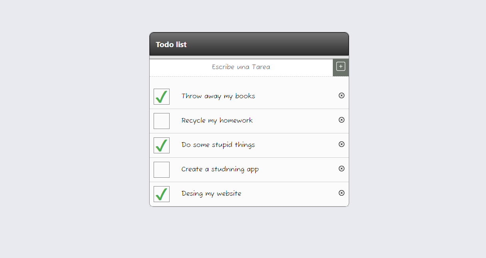

# Aplicación de Gestión de Tareas con React

## Descripción General

Esta aplicación web fue creada utilizando React para gestionar una lista de tareas. Utiliza componentes funcionales, el hook `useState` para el manejo del estado, el hook `useEffect` para realizar efectos secundarios y varios eventos para la interacción del usuario.

## Componentes

### Componente TaskList (`TaskList.js`)

Este componente muestra la lista de tareas. Recibe la lista de tareas y funciones para manejar eventos relacionados con las tareas como propiedades. Cada tarea está representada por el componente `TaskItem`.

### Componente TaskItem (`TaskItem.js`)

Este componente representa individualmente una tarea, mostrando el nombre de la tarea y un botón para marcarla como completada. Utiliza estado local para gestionar la apariencia de la tarea, como tachado cuando está completada.

### Componente TaskForm (`TaskForm.js`)

Este componente contiene un formulario para agregar nuevas tareas. Utiliza estado local para gestionar la entrada del usuario y envía la nueva tarea a la lista principal.

## Manejo de Estado con `useState`

### Estado Principal (`App.js`)

El componente principal utiliza el hook `useState` para gestionar el estado de la lista de tareas. Cada tarea es un objeto con propiedades como id, nombre y completada.

## Efectos con `useEffect`

### Efecto de Actualización (`App.js`)

El hook `useEffect` en el componente principal se utiliza para realizar una acción (por ejemplo, mostrar un mensaje) cuando el estado de la lista de tareas cambia.

## Interacción del Usuario - Eventos

### Eventos en el Componente TaskList (`TaskList.js`)

Se implementan eventos que permiten al usuario interactuar con cada tarea (marcar como completada, eliminar, etc.). Estos eventos modifican el estado principal (`tasks`).

### Eventos en el Componente TaskForm (`TaskForm.js`)

Se implementan eventos para gestionar la entrada del usuario y agregar nuevas tareas a la lista.

## Estilo

Se aplican estilos CSS para mejorar la apariencia de los componentes. Puedes utilizar bibliotecas como styled-components si lo deseas.

## Características Opcionales

### Persistencia de Datos con `localStorage`

Característica opcional implementada: la aplicación persiste las tareas incluso después de recargar la página utilizando `localStorage`.

## Inicio Rápido

1. Clona el repositorio.
2. Navega al directorio del proyecto.
3. Ejecuta `npm install` para instalar las dependencias.
4. Ejecuta `npm start` para iniciar el servidor de desarrollo.

### ¡Trabajo Grupal - Grupo E!
